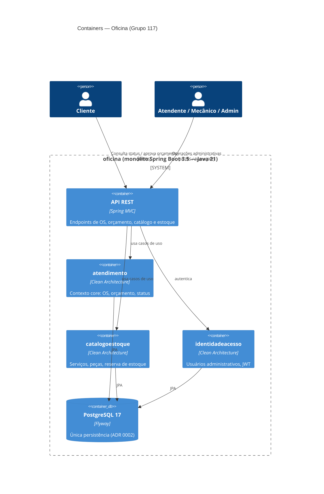

# C4 — Container

```mermaid
C4Container
    title Containers — Oficina (Grupo 117)

    Person(cliente, "Cliente")
    Person(equipe, "Atendente / Mecânico / Admin")

    System_Boundary(monolito, "oficina (monólito Spring Boot 3.5 — Java 21)") {
        Container(api, "API REST", "Spring MVC", "Endpoints de OS, orçamento, catálogo e estoque")
        Container(atendimento, "atendimento", "Clean Architecture", "Contexto core: OS, orçamento, status")
        Container(catalogo, "catalogoestoque", "Clean Architecture", "Serviços, peças, reserva de estoque")
        Container(identidade, "identidadeacesso", "Clean Architecture", "Usuários administrativos, JWT")
        ContainerDb(db, "PostgreSQL 17", "Flyway", "Única persistência (ADR 0002)")
    }

    Rel(cliente, api, "Consulta status / aprova orçamento", "HTTPS")
    Rel(equipe, api, "Operações administrativas", "HTTPS / Bearer JWT")
    Rel(api, atendimento, "usa casos de uso")
    Rel(api, catalogo, "usa casos de uso")
    Rel(api, identidade, "autentica")
    Rel(atendimento, db, "JPA")
    Rel(catalogo, db, "JPA")
    Rel(identidade, db, "JPA")
```
