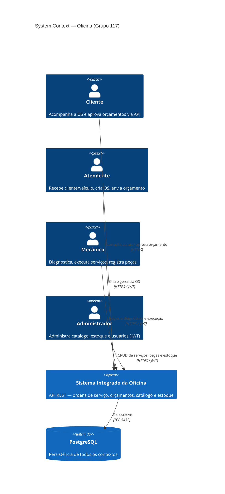

# C4 — System Context

Sistema Integrado de Atendimento e Execução de Serviços da oficina.

```mermaid
C4Context
    title System Context — Oficina (Grupo 117)

    Person(cliente, "Cliente", "Acompanha a OS e aprova orçamentos via API")
    Person(atendente, "Atendente", "Recebe cliente/veículo, cria OS, envia orçamento")
    Person(mecanico, "Mecânico", "Diagnostica, executa serviços, registra peças")
    Person(admin, "Administrador", "Administra catálogo, estoque e usuários (JWT)")

    System(oficina, "Sistema Integrado da Oficina", "API REST — ordens de serviço, orçamentos, catálogo e estoque")

    Rel(cliente, oficina, "Consulta status / aprova orçamento", "HTTPS")
    Rel(atendente, oficina, "Cria e gerencia OS", "HTTPS / JWT")
    Rel(mecanico, oficina, "Registra diagnóstico e execução", "HTTPS / JWT")
    Rel(admin, oficina, "CRUD de serviços, peças e estoque", "HTTPS / JWT")

    SystemDb(pg, "PostgreSQL", "Persistência de todos os contextos")
    Rel(oficina, pg, "Lê e escreve", "TCP 5432")
```
