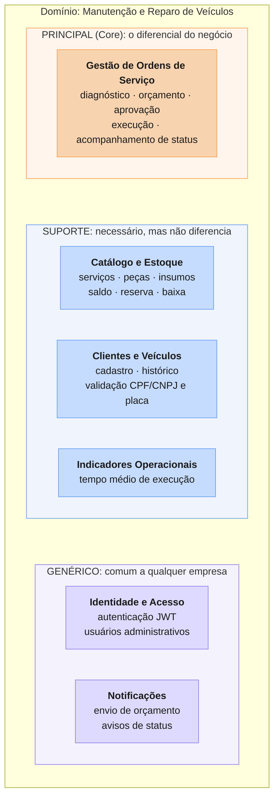
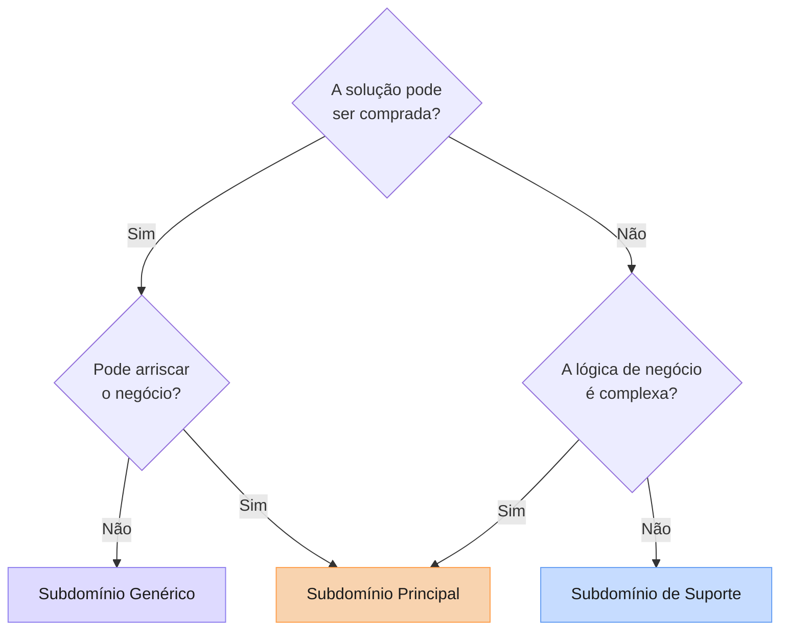

# Diagramas DDD

## Diagrama de Subdomínios

Domínio: **Manutenção e Reparo de Veículos**

### Classificação e justificativa

| Subdomínio | Tipo | Justificativa | Bounded Context |
|---|---|---|---|
| Gestão de Ordens de Serviço | Principal | É o diferencial da oficina (acompanhamento em tempo real e aprovação pelo cliente) e resolve as dores centrais do negócio. Lógica complexa: regras de transição de status e de orçamento. | Atendimento (Core) |
| Catálogo e Estoque | Suporte | Necessário para montar o orçamento, mas não diferencia a oficina. Lógica relativamente simples (CRUD com reserva e baixa). Poderia ser um ERP pronto, mas a reserva está acoplada ao fluxo da OS. | Catálogo e Estoque |
| Clientes e Veículos | Suporte | Cadastro e histórico, basicamente CRUD com validação de CPF/CNPJ e placa. Sem vantagem competitiva. | A definir |
| Indicadores Operacionais | Suporte | Cálculo derivado dos dados da OS (tempo médio de execução), sem regra própria complexa. | Atendimento |
| Identidade e Acesso | Genérico | Toda empresa tem; existe solução pronta e não diferencia o negócio. | Identidade e Acesso |
| Notificações | Genérico | Commodity; pode usar serviço pronto de e-mail ou push. | Sem contexto próprio no MVP |

### Critério de classificação

Fluxograma de Vlad Khononov (Aula 1 — Introdução ao DDD):

> Versão visual no Miro: [Diagrama de Subdomínios](https://miro.com/app/board/uXjVHnu_abs=/?moveToWidget=3458764685741236999)
